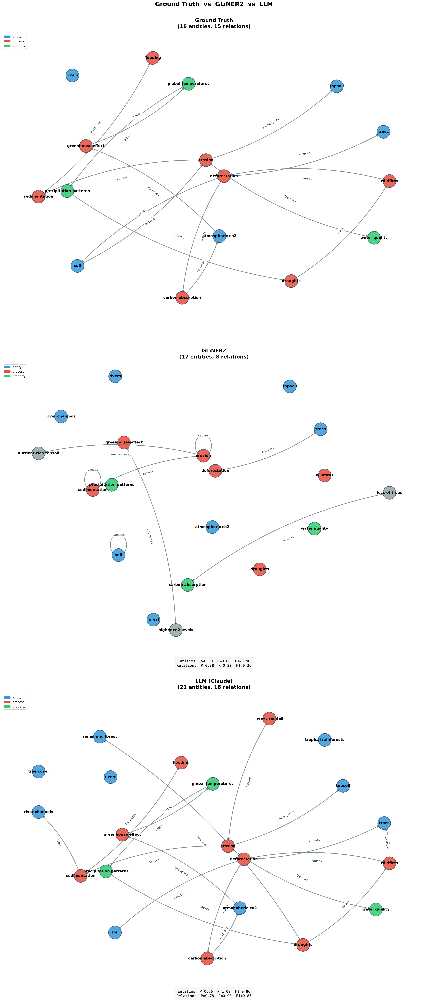

# Can a small encoder build relational graphs from text?

> **TL;DR:** We test whether a small encoder model (GLiNER2, 205M params) can extract a relational graph from text — the first rung of Judea Pearl's causal ladder. Entity extraction works well (F1 = 0.90). Relation extraction does not (F1 = 0.26 vs 0.85 for an LLM). The path forward is a hybrid: encoder for entities, LLM for relations.

---

## The question

Given a piece of text, can we automatically extract a **relational graph** — a set of entities and the relationships stated between them?

This is the first rung of Judea Pearl's [ladder of causation](https://en.wikipedia.org/wiki/Causal_model#The_ladder_of_causation): **association**. Before we can ask *why* things happen (intervention, rung 2) or *what would have happened* (counterfactuals, rung 3), we need to know *what goes with what*. A relational graph captures that: it records which entities a text mentions and what the text claims about how they are connected.

```
deforestation → removes → trees
erosion → degrades → water quality
```

This is not a causal graph. A relational graph does not claim that one thing *causes* another — only that the text says they are related, and in what way. Causality would require interventions, controls, or at least a direction that survives confounding. We are not there. We are asking the simpler question: **can we recover the relational structure a text expresses?**

## Why bother?

LLMs can do this. Give one a schema, ask it to return entities and relations as JSON, and it works. But every sentence runs through a billion-parameter decoder. That's fine for one article. It becomes expensive when processing thousands of notes, or rebuilding a graph every time a note changes.

**Can a smaller, specialized model do most of the extraction more cheaply?**

## The approach: highlighter vs novelist

A language model is a *writer*: it reads a page and produces another page. An encoder like [GLiNER2](https://github.com/urchade/GLiNER) is a *highlighter*: it reads a page and marks the spans that match a schema you give it.

```
[ENTITY: sleep deprivation] → [RELATION: slows] → [ENTITY: reaction time]
```

GLiNER2 (205M parameters) takes a schema of entity types and relation types, and returns spans from the original text with confidence scores. No generation, no token cost. One forward pass.

The bet: entity extraction (finding the nodes) might work well with a small encoder. Relation extraction (wiring the edges) is harder and might still need an LLM.

## Experiment: ground-truth benchmark

We wrote a short paragraph about a **deforestation feedback loop** with 16 entities and 15 relations forming a directed cycle. Both GLiNER2 and an LLM (Claude) extracted entities and relations from the same text, scored against hand-labeled ground truth.

### Test text

> Deforestation removes large areas of trees from tropical rainforests. Without tree cover, soil is directly exposed to heavy rainfall, which causes erosion. Erosion washes nutrient-rich topsoil into rivers, degrading water quality and causing sedimentation. Sedimentation blocks river channels, increasing the risk of flooding downstream. Meanwhile, the loss of trees reduces carbon absorption, accelerating the rise of atmospheric CO2. Higher CO2 levels intensify the greenhouse effect, raising global temperatures. Rising temperatures alter precipitation patterns, leading to more frequent droughts. Droughts weaken the remaining forest, making it more vulnerable to wildfires. Wildfires destroy yet more trees, feeding back into deforestation.

### How we score

We compare each extractor's output against the hand-labeled ground truth using three metrics:

- **Precision** — *of everything the model returned, how much was actually correct?* If a model extracts 10 entities but only 9 match the ground truth, precision = 9/10 = 0.90. Precision catches **over-extraction**: a model that invents things it shouldn't will have low precision.
- **Recall** — *of everything that exists in the ground truth, how much did the model find?* If there are 16 ground-truth entities and the model found 14, recall = 14/16 = 0.88. Recall catches **missed items**: a model that plays it safe and only returns obvious things will have low recall.
- **F1** — a single number that combines both, computed as 2 × (precision × recall) / (precision + recall). It is *not* a simple average — if either precision or recall is near zero, F1 drops sharply. A model with precision = 1.0 but recall = 0.01 (found one thing perfectly, missed everything else) gets an F1 of just 0.02. You need both to be high for F1 to be high.

**Why we need both precision and recall:** A model that returns *everything* as an entity would get perfect recall (it misses nothing) but terrible precision (most of its answers are wrong). A model that returns *only one entity* it's very confident about would get perfect precision (it's never wrong) but terrible recall (it misses almost everything). Neither extreme is useful. Precision and recall measure these two different failure modes, and F1 tells you whether a model avoids both.

We compute these separately for **entities** (did you find the right nodes?) and **relations** (did you draw the right edges between them?).

### Results

| Metric | GLiNER2 (205M) | LLM (Claude) |
|--------|:---:|:---:|
| **Entity Precision** | **0.93** | 0.76 |
| **Entity Recall** | 0.88 | **1.00** |
| **Entity F1** | **0.90** | 0.86 |
| **Relation Precision** | 0.38 | **0.78** |
| **Relation Recall** | 0.20 | **0.93** |
| **Relation F1** | 0.26 | **0.85** |

### Visual comparison

All three graphs use the same node layout — positions are anchored to the ground truth so you can compare at a glance which edges are present or missing.



**Top — Ground truth** (16 entities, 15 relations): the complete relational cycle we labeled by hand.
**Middle — GLiNER2** (17 entities, 8 relations): finds most nodes in the right places, but the wiring is sparse — only 3 of 15 edges are correct, and several are self-loops.
**Bottom — LLM** (21 entities, 18 relations): nearly complete recovery of the relational structure, with a few extra nodes on the periphery.

## Analysis

### Entity extraction: GLiNER2 holds its own

GLiNER2's entity F1 (0.90) actually beats the LLM (0.86). It found 14 of 16 ground-truth entities with only 1 false positive. The LLM found everything (recall 1.0) but over-extracted with 5 extra entities.

For entity recognition alone, a 205M encoder running in 0.4 seconds on CPU is competitive with a billion-parameter decoder consuming API tokens.

### Relation extraction: the hard problem

This is where the gap opens. GLiNER2 found only 3 of 15 relations correctly (recall = 0.20), and 5 of its 8 extractions were self-loops ("erosion causes erosion", "soil exposes soil").

Looking at the source code, GLiNER2's relation extraction independently finds the "best head span" and "best tail span" for each relation type. It doesn't reason about which entity relates to which — it pattern-matches two spans separately and pairs them. That's why it produces self-loops and misses connections across sentences.

The LLM recovered 14 of 15 relations (recall = 0.93). It only missed one where the link runs through an intermediate step not stated explicitly.

### Why the gap?

1. **Relation extraction requires argument structure.** An encoder excels at finding *where* things are. Linking *which* thing relates to *which* requires parsing who-does-what-to-whom — a reasoning task.
2. **Self-loop artifacts.** The model anchors on the strongest span and maps it to both head and tail.
3. **Cross-sentence dependencies.** Some relations span multiple sentences. Entity detection handles this; relation pairing degrades over distance.

## The path forward: a hybrid architecture

The results suggest a practical split:

- **Entity extraction → small encoder** (GLiNER2). Fast, cheap, high precision.
- **Relation extraction → focused LLM pass** over pre-extracted entities. Cheaper than full LLM extraction because the entity set is already given — the LLM only needs to wire edges, not discover nodes.

This hybrid could preserve most of the cost savings while keeping relation quality high. And once we have reliable relational graphs (Pearl's rung 1), we can start asking whether any of those edges are causal — but that's a different experiment.

## Reproduce

```bash
# Set up
python3 -m venv ~/.virtualenvs/relgraph
~/.virtualenvs/relgraph/bin/pip install -r code/requirements.txt

# Run the benchmark
cd code/
~/.virtualenvs/relgraph/bin/python benchmark_ground_truth.py \
  --llm-file ../data/llm_extraction.json \
  --output-dir output/benchmark
```

## Status

This is a work in progress. Next experiments:

- [ ] Hybrid pipeline: GLiNER2 entities → constrained LLM for relations
- [ ] Test on real notes instead of synthetic text
- [ ] Cost comparison: full LLM vs hybrid per 1000 documents
- [ ] Vector-similarity linking as an alternative to LLM relation extraction

---

*Filip Vercruysse — September 2026*
