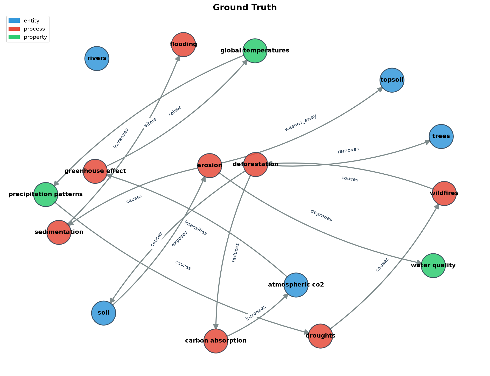
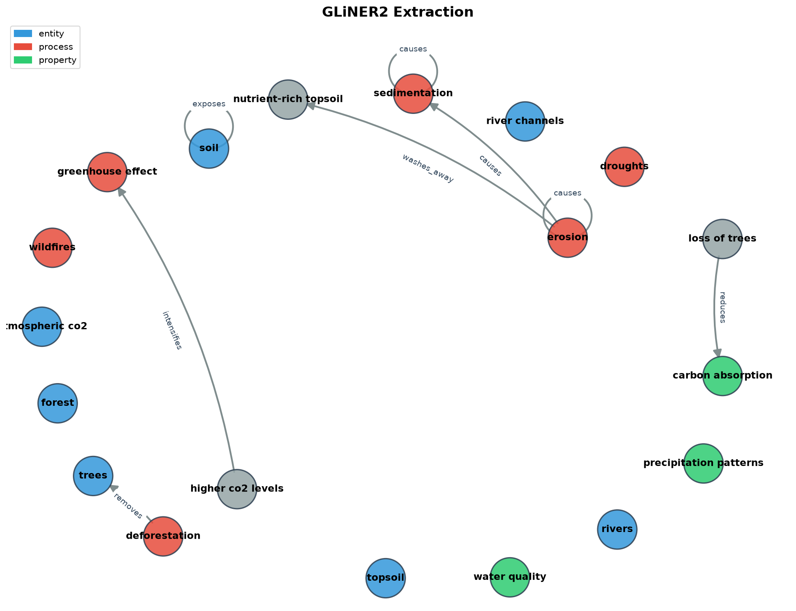
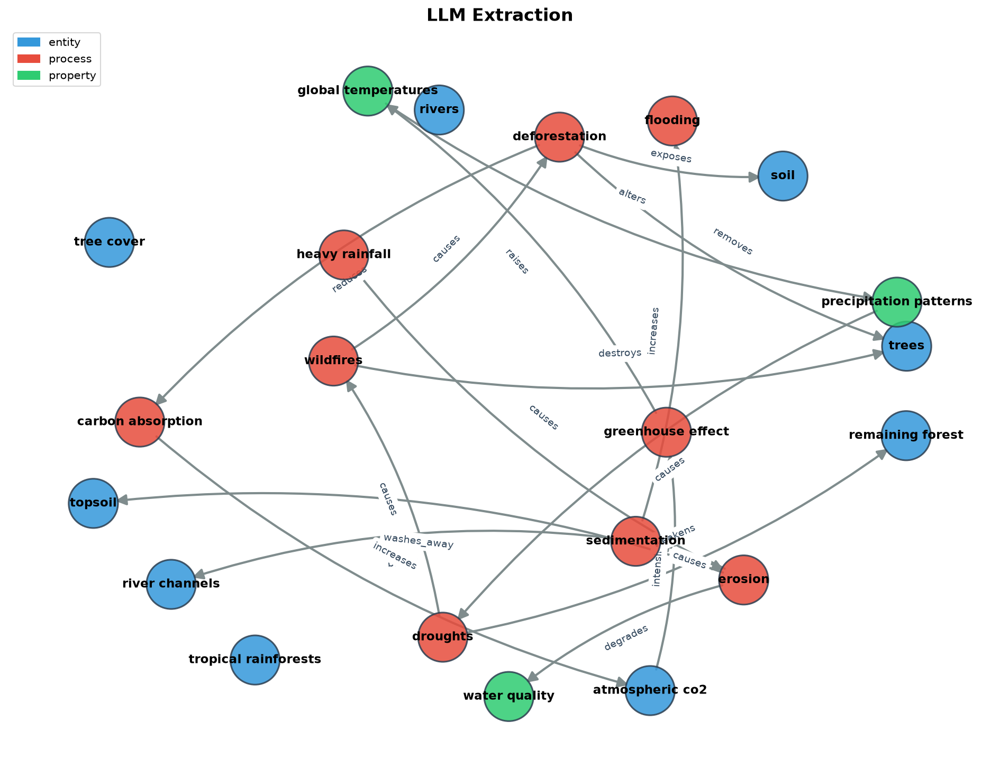

# Can we build causal knowledge graphs from text — cheaply?

> **TL;DR:** We test whether a small encoder model (GLiNER2, 205M params) can replace a large language model for extracting causal graphs from text. Entity extraction works well (F1 = 0.90). Relation extraction does not (F1 = 0.26 vs 0.85 for the LLM). The path forward is a hybrid: encoder for entities, LLM for relations.

---

## The question

Can we take a piece of text and automatically turn it into a **causal knowledge graph**, without relying on a large language model for every step?

A knowledge graph represents information as nodes (concepts) and edges (relationships). A **causal** graph makes a stronger claim: the arrows mean one thing *influences* another.

```
hot weather → increases → ice cream sales
hot weather → increases → sunburn
```

The direction of the arrows matters. They turn a collection of facts into a model of how events influence one another. Such a graph could help us search notes in a more meaningful way — not just "which notes mention sleep?" but "what do my notes claim *improves* sleep?"

## Why this matters

LLMs are a natural way to build such graphs. Give one a schema, ask it to return JSON, and it works. But it's slow and expensive. Every sentence goes through a billion-parameter decoder. That may be fine for one article. It becomes a problem when processing thousands of notes, or rebuilding the graph every time a note changes.

**Can a smaller, specialized model do most of the extraction more efficiently?**

## The approach: highlighter vs novelist

A general language model is a *writer*: it reads a page and produces another page. An encoder like [GLiNER2](https://github.com/urchade/GLiNER) is a *highlighter*: it reads a page and marks the important parts already present.

```
[CAUSE: sleep deprivation] → [RELATION: slows] → [EFFECT: reaction time]
```

GLiNER2 (205M parameters) is told which kinds of things to look for — you give it a schema of entity types and relation types, and it returns spans from the original text with confidence scores. No generation, no token cost. One forward pass.

The bet: entity extraction (finding the nodes) might work well with a small encoder. Relation extraction (wiring the edges) is harder and might still need an LLM.

## Experiment: ground-truth benchmark

We wrote a short paragraph with an unambiguous causal structure — a **deforestation feedback loop** with 16 entities and 15 causal relations forming a directed cycle. Both GLiNER2 and an LLM (Claude) extracted entities and relations from the same text, scored against hand-labeled ground truth.

### Test text

> Deforestation removes large areas of trees from tropical rainforests. Without tree cover, soil is directly exposed to heavy rainfall, which causes erosion. Erosion washes nutrient-rich topsoil into rivers, degrading water quality and causing sedimentation. Sedimentation blocks river channels, increasing the risk of flooding downstream. Meanwhile, the loss of trees reduces carbon absorption, accelerating the rise of atmospheric CO2. Higher CO2 levels intensify the greenhouse effect, raising global temperatures. Rising temperatures alter precipitation patterns, leading to more frequent droughts. Droughts weaken the remaining forest, making it more vulnerable to wildfires. Wildfires destroy yet more trees, feeding back into deforestation.

### Results

| Metric | GLiNER2 (205M) | LLM (Claude) |
|--------|:---:|:---:|
| **Entity Precision** | **0.93** | 0.76 |
| **Entity Recall** | 0.88 | **1.00** |
| **Entity F1** | **0.90** | 0.86 |
| **Relation Precision** | 0.38 | **0.78** |
| **Relation Recall** | 0.20 | **0.93** |
| **Relation F1** | 0.26 | **0.85** |

### Visual comparison

**Ground truth** — the complete 16-node causal cycle:



**GLiNER2** — finds most entities but only 3 of 15 relations, with several self-loops:



**LLM (Claude)** — nearly perfect recovery of the full causal chain:



**Side-by-side comparison:**


## Analysis

### Entity extraction: GLiNER2 holds its own

GLiNER2's entity F1 (0.90) actually beats the LLM (0.86). It found 14 of 16 ground-truth entities with only 1 false positive. The LLM found everything (recall 1.0) but over-extracted with 5 extra entities.

For entity recognition alone, a 205M encoder running in 0.4 seconds on CPU is competitive with a billion-parameter decoder consuming API tokens.

### Relation extraction: the hard problem

This is where the gap opens dramatically. GLiNER2 found only 3 of 15 relations correctly (recall = 0.20), and 5 of its 8 extractions were self-loops ("erosion causes erosion", "soil exposes soil").

Looking at the source code, GLiNER2's relation extraction independently finds the "best head span" and "best tail span" for each relation type. It doesn't reason about which entity causes which — it pattern-matches two spans separately and pairs them. That's why it produces self-loops and misses long-range causal chains.

The LLM recovered 14 of 15 relations (recall = 0.93). It only missed one subtle chain where the causal link goes through an intermediate step not mentioned explicitly.

### Why the gap?

1. **Relation extraction requires argument structure.** An encoder excels at finding *where* things are, but linking *which* thing causes *which* requires parsing who-does-what-to-whom — fundamentally a reasoning task.
2. **Self-loop artifacts.** The model anchors on the strongest span and maps it to both head and tail.
3. **Long-range dependencies.** The feedback loop (wildfires → deforestation) spans the entire paragraph. Entity detection handles this; relation pairing does not.

## The path forward: a hybrid architecture

The results suggest a practical split:

- **Entity extraction → small encoder** (GLiNER2). Fast, cheap, high precision.
- **Relation extraction → focused LLM pass** over pre-extracted entities. Cheaper than full LLM extraction because the entity set is already given — the LLM only needs to wire connections, not discover nodes.

This hybrid could preserve most of the cost savings (entities are the bulk of the extraction work) while keeping relation quality high.

## Reproduce

```bash
# Set up
python3 -m venv ~/.virtualenvs/vector-search-ast
~/.virtualenvs/vector-search-ast/bin/pip install -r code/requirements.txt

# Run the benchmark
cd code/
~/.virtualenvs/vector-search-ast/bin/python benchmark_ground_truth.py \
  --llm-file output/benchmark/llm_extraction.json \
  --output-dir output/benchmark
```

## Status

This is a work in progress. Next experiments:

- [ ] Hybrid pipeline: GLiNER2 entities → constrained LLM for relations
- [ ] Test on real Obsidian notes instead of synthetic text
- [ ] Cost comparison: full LLM vs hybrid per 1000 notes
- [ ] Vector-similarity linking as an alternative to LLM relation extraction

---

*Filip Vercruysse — September 2026*
